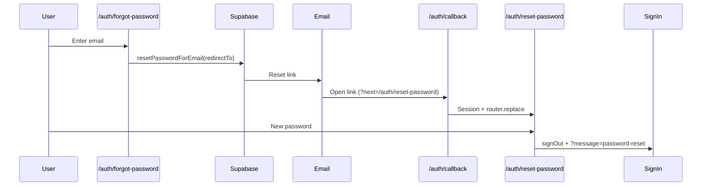

# Password reset — audit & configuration

Last reviewed: May 2026

## Intended flow



1. User opens **`/auth/forgot-password`** (from client or lawyer sign-in; `?from=lawyer` restores the correct Back link).
2. App calls `supabase.auth.resetPasswordForEmail` with  
   `redirectTo = {SITE}/auth/callback?next=/auth/reset-password`  
   (see `getPasswordResetCallbackUrl()` in `lib/auth/redirect-urls.ts`).
3. Supabase sends the email; the link must end up on **`/auth/callback`** (or **`/auth/reset-password`** with tokens — also supported).
4. Callback establishes the session and sends the user to **`/auth/reset-password`** (recovery session is **not** signed out).
5. User sets a new password; app signs out and redirects to the correct sign-in page with **`?message=password-reset`**.

Email verification uses a **different** path (direct to sign-in, Resend + `generateLink(magiclink)`). Do not mix the two.

## Supabase Dashboard checklist (production)

**Authentication → URL configuration**

| Setting | Example (production) |
|--------|----------------------|
| Site URL | `https://wisecase.rapidnextech.com` |
| Redirect URLs | `https://wisecase.rapidnextech.com/auth/callback` |
| | `https://wisecase.rapidnextech.com/auth/callback?next=%2Fauth%2Freset-password` |
| | `https://wisecase.rapidnextech.com/auth/reset-password` |
| | `https://wisecase.rapidnextech.com/auth/client/sign-in` |
| | `https://wisecase.rapidnextech.com/auth/lawyer/sign-in` |

**Authentication → Email templates → Reset password**

- Default Supabase template is fine if links use `{{ .ConfirmationURL }}` (includes `redirect_to`).
- Do **not** point the button only to `/auth/reset-password` unless that exact URL is allow-listed.

**Environment**

- `NEXT_PUBLIC_SITE_URL` must match the public app origin (no trailing slash). Used for all `redirectTo` values.

## Code map

| File | Role |
|------|------|
| `app/auth/forgot-password/page.tsx` | Request reset email |
| `app/auth/callback/page.tsx` | Exchange code/hash; route recovery → reset page |
| `app/auth/reset-password/page.tsx` | Accept new password (handles hash/code if link lands here) |
| `lib/auth/redirect-urls.ts` | `getPasswordResetCallbackUrl()`, allow-listed `next` paths |
| `lib/auth/establish-session-from-url.ts` | Shared token/code handling |
| `components/auth/oauth-callback-hash-redirect.tsx` | If Supabase lands on `/` with recovery hash, forward to callback |

## Fallback when Site URL is wrong

If Supabase redirects to the **site root** with `#access_token=...&type=recovery`, `OAuthCallbackHashRedirect` forwards to `getPasswordResetCallbackUrl()` instead of the sign-in page (previously misrouted to email verification).

## Manual test plan

1. **Client** — Sign in → Forgot password → submit email → open link → set password → land on client sign-in with success banner.
2. **Lawyer** — Same from `/auth/lawyer/sign-in` (`?from=lawyer` on forgot page).
3. **Expired link** — Old link → `/auth/forgot-password?error=link-expired` with toast.
4. **Unknown email** — Supabase still returns success (no account enumeration); same UX as success.

## Diagnostic script

```bash
node scripts/test-password-reset-email.mjs your@email.com
```

Prints the `redirectTo` URL and validates `generateLink({ type: "recovery" })` without sending mail.

## Differences from email verification

| | Verification | Password reset |
|--|--------------|----------------|
| Trigger | Sign-up / resend API | `resetPasswordForEmail` |
| Email sender | Resend (custom HTML) | Supabase Auth email |
| Landing | `/auth/client` or `/auth/lawyer` sign-in | `/auth/callback?next=/auth/reset-password` |
| After link | Sign out, mark verified | Keep session until password updated |
